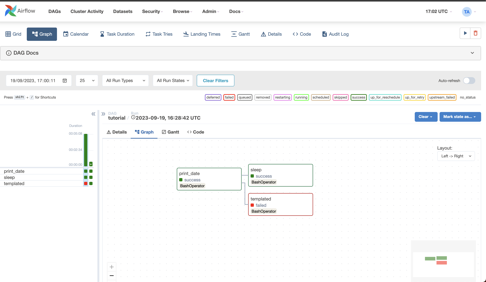

# What is Airflow™?

Apache Airflow™ is an open-source platform for developing, scheduling, and monitoring batch-oriented workflows. Airflow’s extensible Python framework enables you to build workflows connecting with virtually any technology. A web interface helps manage the state of your workflows. Airflow is deployable in many ways, varying from a single process on your laptop to a distributed setup to support even the biggest workflows.

## Workflows as code
The main characteristic of Airflow workflows is that all workflows are defined in Python code. “Workflows as code” serves several purposes:

- Dynamic: Airflow pipelines are configured as Python code, allowing for dynamic pipeline generation.

- Extensible: The Airflow™ framework contains operators to connect with numerous technologies. All Airflow components are extensible to easily adjust to your environment.

- Flexible: Workflow parameterization is built-in leveraging the Jinja templating engine.

Take a look at the following snippet of code:

```python
from datetime import datetime

from airflow import DAG
from airflow.decorators import task
from airflow.operators.bash import BashOperator

# A DAG represents a workflow, a collection of tasks
with DAG(dag_id="demo", start_date=datetime(2022, 1, 1), schedule="0 0 * * *") as dag:
    # Tasks are represented as operators
    hello = BashOperator(task_id="hello", bash_command="echo hello")

    @task()
    def airflow():
        print("airflow")

    # Set dependencies between tasks
    hello >> airflow()

```

Here you see:

A DAG named “demo”, starting on Jan 1st 2022 and running once a day. A DAG is Airflow’s representation of a workflow.

Two tasks, a BashOperator running a Bash script and a Python function defined using the @task decorator

>> between the tasks defines a dependency and controls in which order the tasks will be executed

Airflow evaluates this script and executes the tasks at the set interval and in the defined order. The status of the “demo” DAG is visible in the web interface:



Demo DAG in the Graph View, showing the status of one DAG run
This example demonstrates a simple Bash and Python script, but these tasks can run any arbitrary code. Think of running a Spark job, moving data between two buckets, or sending an email. The same structure can also be seen running over time:


Demo DAG in the Grid View, showing the status of all DAG runs
Each column represents one DAG run. These are two of the most used views in Airflow, but there are several other views which allow you to deep dive into the state of your workflows.

## Why Airflow™?
Airflow™ is a batch workflow orchestration platform. The Airflow framework contains operators to connect with many technologies and is easily extensible to connect with a new technology. If your workflows have a clear start and end, and run at regular intervals, they can be programmed as an Airflow DAG.

If you prefer coding over clicking, Airflow is the tool for you. Workflows are defined as Python code which means:

- Workflows can be stored in version control so that you can roll back to previous versions
- Workflows can be developed by multiple people simultaneously
- Tests can be written to validate functionality
- Components are extensible and you can build on a wide collection of existing components

Rich scheduling and execution semantics enable you to easily define complex pipelines, running at regular intervals. Backfilling allows you to (re-)run pipelines on historical data after making changes to your logic. And the ability to rerun partial pipelines after resolving an error helps maximize efficiency.

Airflow’s user interface provides:

1- In-depth views of two things:
- Pipelines
- Tasks

2- Overview of your pipelines over time

From the interface, you can inspect logs and manage tasks, for example retrying a task in case of failure.

The open-source nature of Airflow ensures you work on components developed, tested, and used by many other companies around the world. In the active community you can find plenty of helpful resources in the form of blog posts, articles, conferences, books, and more. You can connect with other peers via several channels such as Slack and mailing lists.

Airflow as a Platform is highly customizable. By utilizing Public Interface of Airflow you can extend and customize almost every aspect of Airflow.

Why not Airflow™?
Airflow™ was built for finite batch workflows. While the CLI and REST API do allow triggering workflows, Airflow was not built for infinitely running event-based workflows. Airflow is not a streaming solution. However, a streaming system such as Apache Kafka is often seen working together with Apache Airflow. Kafka can be used for ingestion and processing in real-time, event data is written to a storage location, and Airflow periodically starts a workflow processing a batch of data.

If you prefer clicking over coding, Airflow is probably not the right solution. The web interface aims to make managing workflows as easy as possible and the Airflow framework is continuously improved to make the developer experience as smooth as possible. However, the philosophy of Airflow is to define workflows as code so coding will always be required.